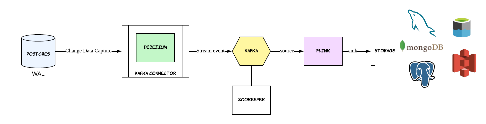
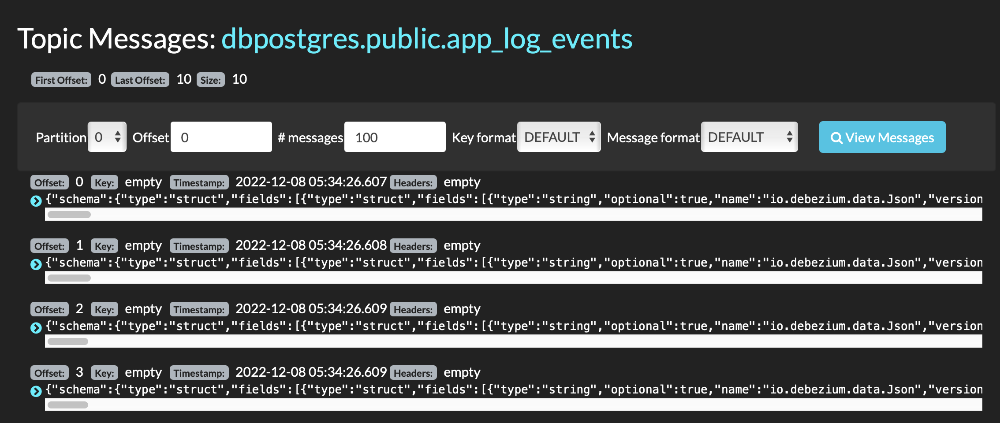
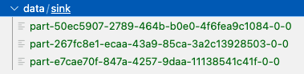

# postgres-cdc
## Idea
Since version 9.4, PostgreSQL offers logical replication for efficiently and safely replicating data between different PostgreSQL instances on possibly different physical machines. It’s a **write ahead log** on disk, which holds all events that change the data of database => allow clients to capture all row level changes.

Advantages of using PostgreSQL’s logical replication for implementing CDC:
- Log-based CDC enables the event-driven capturing of data changes in real-time. Downstream applications have always access to the latest data from PostgreSQL.
- Can detect all change event types in PostgreSQL: INSERTs, UPDATEs, and DELETES.
- Consuming events via logical replication boils down to directly accessing the file system, which does not impact the performance of the PostgreSQL database

Disadvantage:
- Logical replication is not supported by very old versions of PostgreSQL (older than 9.4)
## Architecture



- Kafka: event streaming platform that is capable of processing massive amounts of real-time data
- Zookeeper: another piece of software from Apache that Kafka uses to store and coordinate configuration
- Debezium: an open source platform for change data capture(CDC). It plugs into Postgres, captures all row level changes and sends it to kafka topic
- Kafka Connect: acts as a bridge for streaming data in and out of Kafka
- Flink: framework and distributed processing engine for stateful computations over unbounded and bounded data streams (in this case used to process real-time data from kafka source and sink)
## Build project
### Prerequisites
- Java 11
- docker-compose
### Procedure
Run `docker-compose up -d`

Set configurarion in Postgres `wal_level` = `logical` (need to restart DB)

Assume the source table is `app_log_events` and has 1 column `payload`
```
CREATE TABLE app_log_events (
  payload jsonb
);
```

Send this configuration with a POST command to running Kafka Connect service
```
{
    "name": "demo-connector",
    "config": {
        "connector.class": "io.debezium.connector.postgresql.PostgresConnector",
        "database.hostname": "postgres",
        "database.port": "5432",
        "database.user": "admin",
        "database.password": "123456",
        "database.dbname": "postgres",
        "table.include.list": "public.app_log_events",
        "database.server.name": "dbpostgres",
        "topic.prefix":"dbpostgres",
        "plugin.name": "pgoutput"
    }
}
```
The service records the configuration and starts one connector task that performs the following actions:
- Connects to the PostgreSQL database.
- Reads the transaction log.
- Streams change event records to Kafka topics.

A topic name `dbpostgres.public.app_log_events` which holds all change events for every row-level, is created

<br><br>

Data is streamed, tranformed, then write to files when rolling policy is met



### Ref
- https://debezium.io/documentation/reference/2.0/connectors/postgresql.html#postgresql-deployment
- https://www.postgresql.org/docs/current/runtime-config-wal.html
- https://datacater.io/blog/2021-09-02/postgresql-cdc-complete-guide.html#cdc-logical-replication
- https://medium.com/event-driven-utopia/8-practical-use-cases-of-change-data-capture-8f059da4c3b7
- https://arctype.com/blog/kafka-tutorial-1/
- https://www.sysleaf.com/kafka-debezium-postgres-setup/
